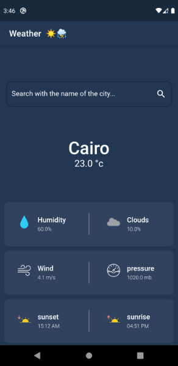

# Weatherapp

A simple flutter weather forecast application based on Weatherbit.io APIs.

## plugins used
- [flutter_bloc](https://pub.dev/packages/flutter_bloc) - A Flutter package that helps implement the BLoC pattern.
- [Chopper](https://pub.dev/packages/chopper) - Chopper is an http client generator using source_gen and inspired by Retrofit.
- [flutter_screenutil](https://pub.dev/packages/flutter_screenutil) - A flutter plugin for adapting screen and font size.Let your UI display a reasonable layout on different screen sizes.
